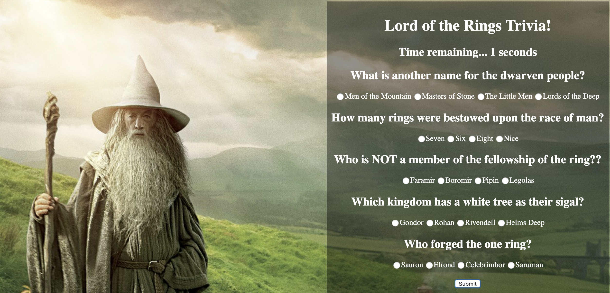

# TriviaGame

* This app is a Lord of the Rings trivia game implemented as a form with a timer. The user has 30 seconds to answer every question correctly. After every question is answered, the user can submit the form to be graded. After the form is submitted or time runs out, the user is prompted with a score relating to how many questions they answered correctly. The trivia game resets afterwards.

[Click here to check out the site!](https://gljacobs.github.io/Trivia-Game/)

## Technologies used:
* HTML 
* CSS
* Javascript
* jQuery

## Author: Gabriel Jacobs